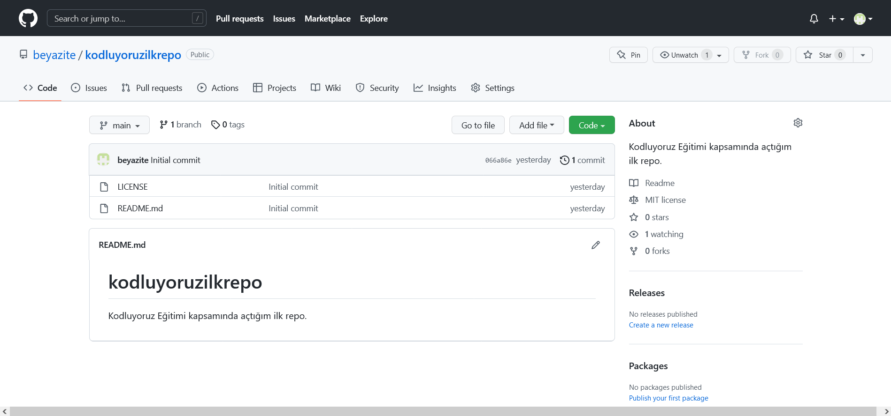

# Kodluyoruz İlk Repo

Bu repo [Kodluyoruz](https://kodluyoruz.org) Front-End Eğitimi'nde oluşturdupumuz ilk repo. İçerisinde bir adet README dosyası, bir adet de index.html barındırıyor.



## Installation

Öncelikle projeyi clonelayın.

```git clone https://github.com/beyazite/kodluyoruzilkrepo.git```

## Usage

Projeyi cloneladıktan sonra Visual Studio Code programında açınız. 

Linux için:
```
cd kodluyoruzilkrepo 
code .
```

## Contributing

Pull requestler kabul edilir. Büyük değişiklikler için, lütfen önce neyi değiştirmek istediğinizi tartışmak için bir konu açınız. 

### Licence
---
[MIT](https://choosealicense.com/licenses/mit/)

---
[Patika.Dev](https://www.patika.dev)